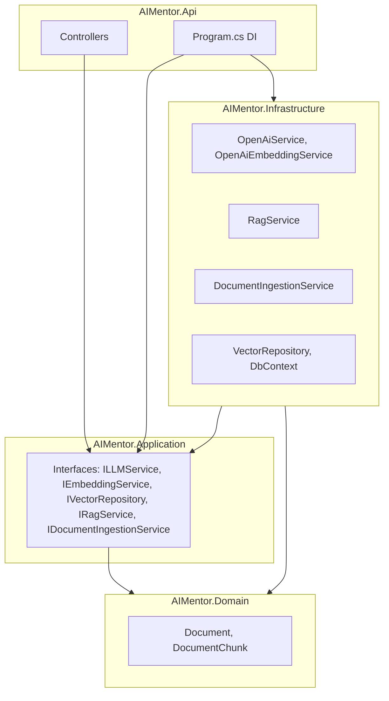
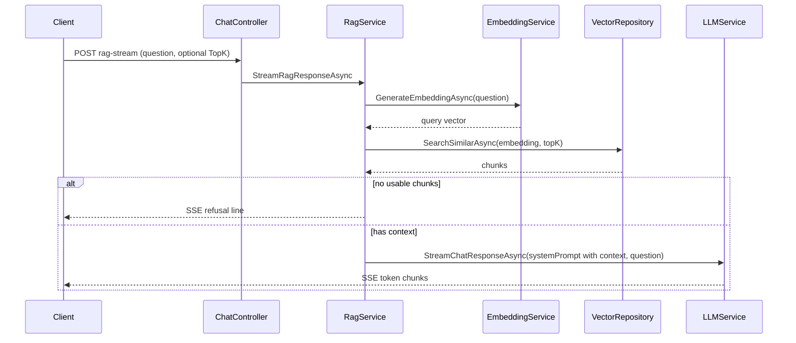

# AI Mentor (AIMentor)

A **learning-focused, production-style** backend that demonstrates how to build **Retrieval-Augmented Generation (RAG)** on the **.NET** stack: ASP.NET Core, OpenAI, PostgreSQL, and **pgvector**. It is intentionally more than a thin ChatGPT wrapper—you will see embeddings, vector search, streaming responses, and clean layering.

---

## What is this project?

**AIMentor** is an **AI Engineering Mentor** API: it can chat with an LLM, **ingest documents** into a vector store, **retrieve** relevant text by semantic similarity, and **answer questions grounded in that stored knowledge** (RAG), including **Server-Sent Events (SSE)** streaming.

The codebase is structured as a **resume-grade** example of:

- Clean Architecture boundaries (Domain → Application → Infrastructure → API)
- Real persistence (EF Core + PostgreSQL + pgvector)
- OpenAI **chat** and **embeddings** (official .NET SDK)
- Configurable secrets (user secrets / environment variables—not committed keys)

---

## Purpose

| Goal | Why it matters |
|------|----------------|
| **Learn by building** | Understand RAG end-to-end: chunk → embed → store → retrieve → prompt → generate. |
| **Architectural discipline** | Keep domain pure, contracts in Application, IO in Infrastructure. |
| **Production patterns** | Streaming APIs, configuration, Dockerized DB, refusal behavior when context is missing. |

This project is **not** optimized for every production concern yet (see [Roadmap](#roadmap-and-future-work)), but it is a **solid foundation** for deeper topics: ANN indexes, hybrid search, memory, and guardrails.

---

## Features

### Implemented today

- **Direct LLM chat** — non-streaming and **SSE streaming** (`/api/chat`, `/api/chat/stream`).
- **Embeddings** — OpenAI embedding model (default `text-embedding-3-small`, 1536 dimensions).
- **Vector storage** — PostgreSQL **pgvector** column `vector(1536)` on chunk rows.
- **Semantic search** — cosine-distance ordering over stored chunk embeddings (`/api/chat/search`).
- **Document ingestion** — `POST /api/documents/ingest`: full document body split into **overlapping character windows**, each segment embedded, **one `Document` + many `DocumentChunk`** rows.
- **RAG + streaming** — `POST /api/chat/rag-stream`: embed question → top-K similar chunks → system prompt with retrieved context → stream model output; **empty index** returns a fixed “not enough information” line without calling the model.
- **Legacy test store** — `POST /api/chat/store` still creates one small document+chunk per call (handy for quick tests; prefer ingest for real content).

### Configuration surface

| Area | Keys (examples) |
|------|------------------|
| OpenAI | `OpenAI:ApiKey`, `OpenAI:Model`, `OpenAI:EmbeddingModel` |
| Secrets | Prefer `dotnet user-secrets` or env `OPENAI_API_KEY` / `OpenAI__ApiKey` |
| RAG | `Rag:TopK` (default chunk count for retrieval) |
| Chunking | `Chunking:MaxChunkChars`, `Chunking:OverlapChars` |
| Database | `ConnectionStrings:DefaultConnection` |

---

## Technology stack

- **.NET 9** — ASP.NET Core Web API  
- **EF Core 9** — migrations, Npgsql provider  
- **PostgreSQL** — Docker (`ankane/pgvector`), port **5433** → 5432 in container  
- **pgvector** — vector similarity (cosine distance in queries)  
- **OpenAI .NET SDK** — v2.9.x (chat + embeddings)

---

## Architecture

High-level **layering** and dependency direction:



**Rules of thumb:**

- **Domain** — entities only; no framework references.  
- **Application** — interfaces and use-case contracts; no EF Core or OpenAI packages.  
- **Infrastructure** — OpenAI, EF Core, repositories, RAG and ingestion implementations.  
- **API** — HTTP surface and composition root (DI registration).

---

## RAG request flow

End-to-end path for **`POST /api/chat/rag-stream`**:



---

## Data model

- **`Document`** — `Id`, `Title`, `Content` (full source text for the logical document).  
- **`DocumentChunk`** — `Id`, `DocumentId`, `Content` (segment text), **`Embedding`** `vector(1536)`.

Ingestion writes **one document** and **many chunks**; legacy `/api/chat/store` creates a new document per call.

---

## Repository layout

| Project | Role |
|---------|------|
| `AIMentor.Domain` | Entities (`Document`, `DocumentChunk`). |
| `AIMentor.Application` | Interfaces for LLM, embeddings, vectors, RAG, ingestion. |
| `AIMentor.Infrastructure` | OpenAI clients, `RagService`, `DocumentIngestionService`, `VectorRepository`, EF migrations. |
| `AIMentor.Api` | Controllers, `Program.cs`, `appsettings.json`. |

Solution file: `AiMentor.sln`.

---

## Getting started

### Prerequisites

- [.NET 9 SDK](https://dotnet.microsoft.com/download)  
- Docker (for PostgreSQL + pgvector)  
- An [OpenAI API key](https://platform.openai.com/api-keys)

### 1. Start PostgreSQL

From the repo root:

```bash
docker compose up -d
```

Default connection in `appsettings.json` uses **localhost:5433**, database `aimentor`, user/password `postgres`/`postgres` (match [`docker-compose.yml`](docker-compose.yml)).

### 2. Apply database migrations

```bash
dotnet ef database update --project AIMentor.Infrastructure --startup-project AIMentor.Api
```

### 3. Configure OpenAI (do not commit keys)

From `AIMentor.Api`:

```bash
cd AIMentor.Api
dotnet user-secrets set "OpenAI:ApiKey" "your-key-here"
```

Alternatives: environment variables `OPENAI_API_KEY` or `OpenAI__ApiKey`.

### 4. Run the API

```bash
dotnet run --project AIMentor.Api
```

Default HTTP URL (see `launchSettings.json`): **http://localhost:5268**

### 5. Try a minimal RAG loop

1. **Ingest** some text:

   `POST /api/documents/ingest`  
   Body: `{ "title": "Notes", "content": "Your long text here..." }`

2. **Ask** with RAG stream:

   `POST /api/chat/rag-stream`  
   Body: `{ "message": "What does the document say about ...?" }`  
   Optional: `"topK": 5` (overrides default from `Rag:TopK`).

Use a client that supports **SSE** (or `curl -N` with appropriate headers) for streaming endpoints.

---

## HTTP API summary

| Method | Route | Description |
|--------|--------|-------------|
| `POST` | `/api/chat` | JSON chat reply (no stream). |
| `POST` | `/api/chat/stream` | SSE stream; direct LLM (default mentor system prompt). |
| `POST` | `/api/chat/rag-stream` | SSE stream; RAG over stored chunks. |
| `POST` | `/api/chat/store` | Legacy: store one message as one doc + chunk. |
| `POST` | `/api/chat/search` | Semantic search smoke test (returns chunk texts). |
| `POST` | `/api/documents/ingest` | Ingest full document with chunking + embeddings. |

**Swagger UI** (Development only): after `dotnet run`, open **https://localhost:7227/swagger** or **http://localhost:5268/swagger** (see `launchSettings.json`). OpenAPI JSON: `/swagger/v1/swagger.json`.

---

## Learning outcomes

After working through this repository, you should be able to explain and demonstrate:

1. **LLM integration** — chat completions, system vs user messages, streaming token deltas.  
2. **Embeddings** — turning text into dense vectors; model choice and dimension alignment with the DB (`1536`).  
3. **Vector databases** — storing vectors in PostgreSQL with pgvector; similarity as distance ordering.  
4. **RAG** — retrieve → inject context into system prompt → generate; **grounding** and **explicit refusal** when context is empty.  
5. **Ingestion** — why chunking and overlap matter; trade-offs of character-based vs token-based splitting.  
6. **Clean Architecture** — dependency direction, interface placement, keeping infrastructure replaceable.  
7. **API design** — SSE for streams, configuration and secrets hygiene.

---

## Roadmap and future work

Aligned with [`project_context.md`](project_context.md):

- **Token-aware chunking** (replace rough character windows).  
- **ANN index** (e.g. IVFFlat on embeddings) for scale.  
- **Hybrid search** (vector + keyword / `tsvector`).  
- **Memory** — chat history, short/long-term context.  
- **Guardrails** — prompt-injection awareness, moderation, faithfulness checks.

---

## Additional documentation

- **[`project_context.md`](project_context.md)** — extended context for IDE assistants and deeper roadmap notes.

---

## License

Specify a license in the repository when you publish it publicly (e.g. MIT). Until then, treat usage as **private/educational** unless you add a `LICENSE` file.
